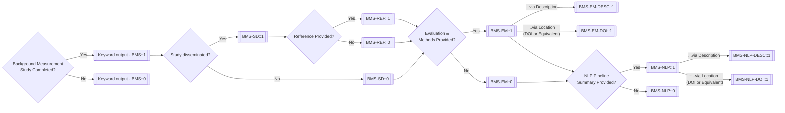

# NLPReportingMethodologyApp
Development of a NLP Reporting Methodology App for the OHDSI Network.

## Meeting Notes:
Meeting notes can be kept in the _Wiki_ tab (for now).

## Issues
- Tasks can be managed as _Issues_
- Progress can be tracked in the _NLPReportingMethodologyApp_ project under the _Projects_ tab. 

## Scoring System and Reporting Methodology
- The scoring system and reporting methodology will be developed at the following source by Daniel Smith:

https://github.com/OHDSI/NLPTools/wiki/NLP-Validation-within-an-OHDSI-Framework

## Decision Tree

