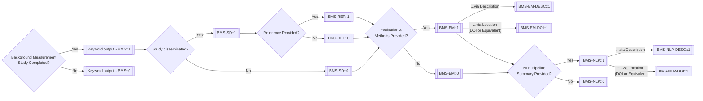

# NLPReportingMethodologyApp
Development of a NLP Reporting Methodology App for the OHDSI Network.

## Meeting Notes:
Meeting notes can be kept in the _Wiki_ tab (for now).

## Issues
- Tasks can be managed as _Issues_
- Progress can be tracked in the _NLPReportingMethodologyApp_ project under the _Projects_ tab. 

## Scoring System and Reporting Methodology
- The scoring system and reporting methodology will be developed at the following source by Daniel Smith:

https://github.com/OHDSI/NLPTools/wiki/NLP-Validation-within-an-OHDSI-Framework

## Decision Trees

### Background Measurement Study Status


### Cohort and Data Generalizability Assessment (Working on this)
```mermaid
flowchart LR
    CDG{Cohort and Data\n Generalizability\n Assessment Completed?} -- Yes --> CDG_T[[Keyword output - CDG::1]] --> VME{Variability between\n measurement and\n deployment environment\n assessed?};
        VME -- Yes --> VME_T[[CDG-VME::1]] --- > REF{Details in\n Reference\n provided?};
            REF -- Yes all\n details --> AQ1_T[[CDG-VME-REF::1]] --> CDM{Cohort definition\n and methods for\n reconsturction\n provided?};
                CDM -- Yes --> CDM_T[[CDG-CDM::1]]
                    CDM_T -- ...via Description --> CDM_DESC[[CDG-CDM-DESC::1]] --> OHDSI{Cohort definition\n and analytic methods\n based on OHDSI tools?};
                    CDM_T -- ...via Location\n (DOI or Equivalent) --> CDM_DOI[[CDG-CDM-DOI::1]]
                    CDM_T --> XXXXXXX;
                        META -- XXXX
                        META -- No --> XXXX
                CDM -- No --> CDM_F[[CDG-CDM::0]] --> XXXXXXX
            REF -- Yes, but\n partial --> AQ1_F[[CDG-VME-REF::0]] --> REF_P{Partial methods\n in Reference\n Provided:};
                REF_P -- ...study\n (env variability) --> AQ2A_T[[CDG-VME-REF::1]]
                REF_P -- ...cohort\n (def and methods) --> AQ2B_T[[CDG-CDM-REF::1]]
                REF_P -- No --> AQ1_F[[CDG-VME-REF-P::0]]

            REF -- No --> AQ1_F[[CDG-VME-REF::0]] --> CDM
        
        XXXX --> CDM{Cohort definition\n and methods for\n reconsturction\n provided?};
            REF -- Yes --> AQ1_T[[CDG-VME-REF::1]] --> ;
                CDM -- Yes --> CDM_T[[CDG-CDM::1]]
                    CDM_T -- ...via Description --> CDM_DESC[[CDG-CDM-DESC::1]]
                    CDM_T -- ...via Location\n (DOI or Equivalent) --> CDM_DOI[[CDG-CDM-DOI::1]]
                    CDM_T --> XXXXXXX
                CDM -- No --> CDM_F[[CDG-CDM::0]] --> XXXXXXX
            REF -- No --> AQ1_F[[VME-REF::0]] --> CDM
        VME -- ...via Location\n (DOI or Equivalent) --> VME_DOI[[CDG-VME-DOI::1]] --> CDM
        VME -- No --> VME_F[[CDG-VME::0]] --> CDM
    CDG -- No --> CDG_F[[Keyword output - CDG::0]]


        SD -- Yes --> SD_T[[CGA-SD::1]] --> REF{Reference Provided?};
            REF -- Yes --> AQ1_T[[CGA-REF::1]] --> EM{Evaluation &\n Methods Provided?};
                EM -- Yes --> EM_T[[CGA-EM::1]]
                    EM_T -- ...via Description --> EM_DESC[[CGA-EM-DESC::1]]
                    EM_T -- ...via Location\n (DOI or Equivalent) --> EM_DOI[[CGA-EM-DOI::1]]
                    EM_T --> NLP1{NLP Pipeline\n Summary Provided?};
                        NLP1 -- Yes --> NLP1_T[[CGA-NLP::1]]
                        NLP1_T -- ...via Description --> AQ3_A[[CGA-NLP-DESC::1]]
                        NLP1_T -- ...via Location\n (DOI or Equivalent) --> AQ3_B[[CGA-NLP-DOI::1]]
                        NLP1 -- No --> NLP1_F[[CGA-NLP::0]]
                EM -- No --> EM_F[[CGA-EM::0]] --> NLP1
            REF -- No --> AQ1_F[[CGA-REF::0]] --> EM
        SD -- No --> SD_F[[CGA-SD::0]] --> EM
    CGA -- No --> CGA_F[[Keyword output - CGA::0]]
    


   ## auto is below 
    
    CGA{Cohort and Data\n Generalizability\n Assessment Completed?} -- Yes --> CGA_T[[Keyword output - CGA::1]] --> SD{Study disseminated?};
        SD -- Yes --> SD_T[[CGA-SD::1]] --> REF{Reference Provided?};
            REF -- Yes --> AQ1_T[[CGA-REF::1]] --> EM{Evaluation &\n Methods Provided?};
                EM -- Yes --> EM_T[[CGA-EM::1]]
                    EM_T -- ...via Description --> EM_DESC[[CGA-EM-DESC::1]]
                    EM_T -- ...via Location\n (DOI or Equivalent) --> EM_DOI[[CGA-EM-DOI::1]]
                    EM_T --> NLP1{NLP Pipeline\n Summary Provided?};
                        NLP1 -- Yes --> NLP1_T[[CGA-NLP::1]]
                        NLP1_T -- ...via Description --> AQ3_A[[CGA-NLP-DESC::1]]
                        NLP1_T -- ...via Location\n (DOI or Equivalent) --> AQ3_B[[CGA-NLP-DOI::1]]
                        NLP1 -- No --> NLP1_F[[CGA-NLP::0]]
                EM -- No --> EM_F[[CGA-EM::0]] --> NLP1
            REF -- No --> AQ1_F[[CGA-REF::0]] --> EM
        SD -- No --> SD_F[[CGA-SD::0]] --> EM
    CGA -- No --> CGA_F[[Keyword output - CGA::0]]
```